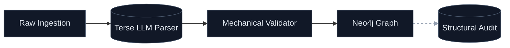
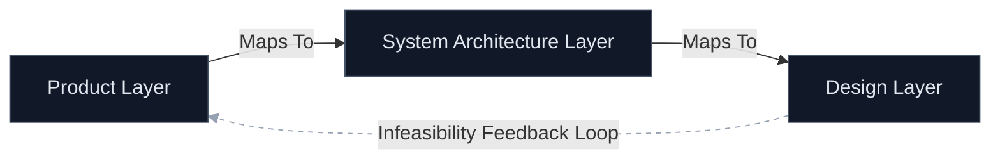

# ProtoProject Design Phases

To bring **ProtoProject** from a vision to an operational reality, the development lifecycle can be broken down into four distinct, evolutionary phases.

By prioritizing deterministic data handling (the "mechanical" layer) before layering on agentic AI behavior, we ensure stability, lower token costs, and a clear lineage of how requirements evolve from a chaotic transcript into structured implementation work packages.

Here is the proposed phased roadmap, focusing on high-level goals, user experiences, and data flows.

## Phase 1: The Bedrock (Ingestion & Mechanical Graph)

### Goal

Establish the core Neo4j database schema, deterministic validation rules, and the initial ingestion pipeline. This phase replaces AI ambiguity with rigid data structures, ensuring every requirement has a unique ID, state, and explicit relationship hooks before any heavy AI orchestration is introduced.

### User Experience

* **Input:** The user feeds a raw, unstructured text file (e.g., a meeting transcript or a brain-dump markdown file) into the system.
* **Interaction:** The user interacts via a simple CLI or basic interface to trigger an ingestion run.
* **Output:** The user receives a summary report showing that $X$ raw nodes were created, alongside a list of initial structural gaps (e.g., "Requirement Y has no parent").

### Data & Information Flow

1. **Raw Text $\rightarrow$ Parser:** Unstructured text is ingested. A lightweight, terse LLM call parses the text into flat, distinct requirement candidates.
2. **Parser $\rightarrow$ Mechanical Validator:** Python routines automatically assign unique IDs, timestamps, and origin metadata.
3. **Validator $\rightarrow$ Neo4j:** The structured nodes and baseline relationships (`is_child_of`, `depends_on`) are committed directly to Neo4j.
4. **Graph $\rightarrow$ Mechanical Auditor:** Non-AI Python scripts scan the graph for structural anomalies (orphaned nodes, cyclical dependencies) and flag them.

---

## Phase 2: The Conversational Architect (Product Requirements & NASA Quality)

### Goal

Introduce LangGraph to orchestrate the refinement of Top-Level Product Requirements. The system transitions from a passive storage bin to an active design partner, auditing requirements against NASA’s high-quality criteria and guiding the user through resolving ambiguities.

### User Experience

* **Interaction:** The system highlights a vague requirement (e.g., *"The system must be fast"*). It presents the specific NASA criteria violated (e.g., *Lack of Verifiability*).
* **The "Concern Value" Toggle:** For each requirement, the user assigns a **Concern Value**. They flag critical paths (e.g., data privacy) as **High Concern** (demanding strict human sign-off) and infrastructure paths as **Low Concern** (granting AI autonomy).
* **Output:** A stabilized, traceable Top-Level Product Requirements Graph.

### Data & Information Flow

1. **Neo4j $\rightarrow$ LangGraph Orchestrator:** LangGraph pulls a requirement node and its immediate neighbors.
2. **Orchestrator $\rightarrow$ NASA Evaluator (AI Agent):** A specialized agent evaluates the node text against NASA quality parameters.
3. **Evaluator $\rightarrow$ User UI:** If a deficiency is found, LangGraph pauses the state machine and pushes a clarification prompt to the user.
4. **User Response $\rightarrow$ Neo4j:** The user's input updates the node, creates a new version entry in the history chain, and changes the state to "Stabilized."

---

## Phase 3: The Multi-Layer Weaver (System Architecture & Design Elaboration)

### Goal

Enable the vertical layering of the graph. The system must now take stabilized Product Requirements and map them down to **System Architecture Requirements** (tech stacks, separation of concerns) and subsequently to **Design Requirements**.

### User Experience

* **Interaction:** The user watches the AI autonomously generate downstream architectural proposals for **Low Concern** domains. For **High Concern** domains, the AI presents architectural options (e.g., Dockerizing constraints) for selection.
* **The Feedback Loop:** If the AI discovers during the design mapping that a product requirement is technically infeasible, the user experiences a "Reverse-Iteration" event, where the system requests permission to supersede or modify the original product requirement.

### Data & Information Flow

1. **Product Graph Layer $\rightarrow$ Architecture Synthesis Agent:** LangGraph passes product constraints to an architecture agent.
2. **Architecture Agent $\rightarrow$ Neo4j:** New nodes are generated representing architectural decisions, linked via `maps_to` or `constrains` relationships to the parent product nodes.
3. **Conflict Detection $\rightarrow$ Reverse Flow:** If a technical bottleneck occurs, an information flow triggers *backward* up the graph, updating the parent product node status to "Under Revision" and alerting the user.

---

## Phase 4: The Autonomous Expeditor (Implementation & Guardrails)

### Goal

The final aggregation of the graph into executable **Implementation Work Packages**. A secondary, independent "Oversight AI Agent" is introduced to govern autonomous changes, ensuring the core vision isn't diluted when low-impact adjustments are made.

### User Experience

* **Interaction:** The user clicks "Generate Work Packages" for a specific epic or the entire project.
* **Autonomous Execution:** For **Low Concern** segments, the system makes minor adjustments or detail completions entirely in the background. The user simply views an audit log of what the Oversight Agent approved.
* **Output:** A clean export of atomic, contextual markdown files or JSON payloads tailored for execution by implementers (or GitHub Copilot), complete with an immutable traceability chain back to the original transcript.

### Data & Information Flow

1. **Design Graph Layer $\rightarrow$ Work Package Aggregator:** The final design nodes are parsed mechanically to compile all necessary parent context.
2. **Proposed Graph Modifications $\rightarrow$ Oversight Agent:** If an implementation detail requires a minor change to a design node, the modification is routed to the Oversight Agent.
3. **Oversight Agent Decision Matrix:**

* *If Impact is Low & Parent Concern is Low:* The agent auto-approves and writes directly to Neo4j.
* *If Impact is High or Parent Concern is High:* The change is routed to the User Approval Queue.

1. **Final Graph State $\rightarrow$ Target Output:** The fully traced packages are compiled for GitHub Copilot ingestion.

---

## Summary of Phase Objectives

| Phase | Core Objective | Primary Tech Layer | User Experience Focus |
| --- | --- | --- | --- |
| **1. The Bedrock** | Ingestion & structural integrity | Python + Neo4j (Mechanical) | Seeing raw data turn into organized, predictable nodes. |
| **2. Conversational Architect** | Product Requirement quality | LangGraph + Terse LLMs | Defining the vision clearly and setting **Concern Values**. |
| **3. Multi-Layer Weaver** | Architecture & Design mapping | Hierarchical Graph Queries | Managing the push-and-pull between vision and technical reality. |
| **4. Autonomous Expeditor** | Implementation & Oversight | Multi-Agent Guardrails | Reviewing auto-approved changes and exporting clean work units. |
