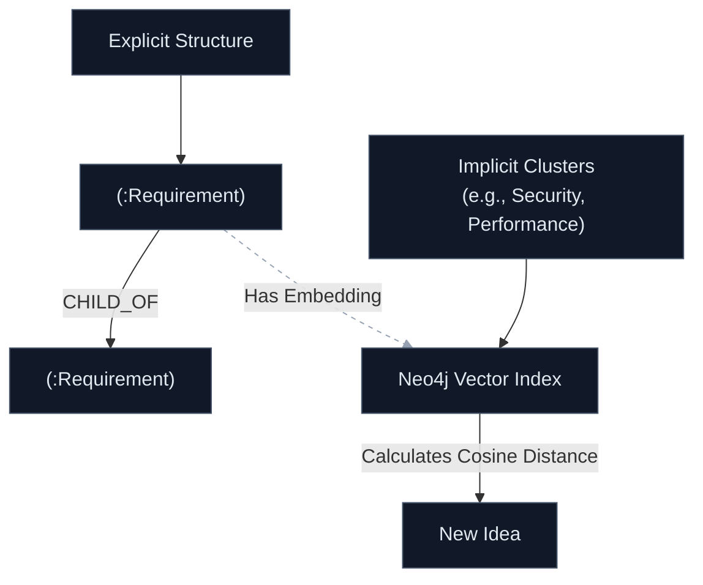

# Phase 1

Integrating vector embeddings right into the foundation is a fantastic architectural instinct. Even if you don't fully exploit vector searching until Phase 2 or 3, setting up **Neo4j as a Graph Vector database** in Phase 1 ensures you don't have to overhaul your data layer later.

By storing vector embeddings directly on your requirement nodes, you get the best of both worlds: explicit, deterministic domain relationships (`is_child_of`) combined with implicit, semantic similarity matching (vector distances). This solves the exact problem you highlighted: finding thematic duplicates or grouping "Version 2" concepts that use completely different wording but mean the same thing.

Let's look at how this impacts the schema and the terminal UI for Phase 1.

## Phase 1 Neo4j Schema (Property & Vector Design)

In Neo4j, you can attach an embedding array property directly to a node and configure a Vector Index on it. For Phase 1, we want a lean, high-performance schema that keeps token costs minimal and mechanical validation fast.

### 1. Node Types & Properties

#### `(:Requirement)`

This is the core atomic unit. To handle evolution and vector search, it needs specific properties:

* `id`: `STR` (e.g., `REQ-001` - deterministic UUID or sequential slug).
* `text`: `STR` (The actual terse chunk of text).
* `embedding`: `LIST<FLOAT>` (The vector representation of `text` for similarity matching).
* `layer`: `STR` (`Product`, `Architecture`, `Design`, `Implementation`).
* `concern_value`: `INT` (0 to 5, mapping human focus).
* `state`: `STR` (`Draft`, `Under_Review`, `Stabilized`, `Superseded`).
* `version`: `INT` (Incremental counter).
* `timestamp`: `INT` (Epoch time).

#### `(:Source)`

Keeps track of where things came from without cluttering the requirement node.

* `id`: `STR` (e.g., `SRC-001`).
* `type`: `STR` (`Transcript`, `Markdown`, `User_CLI`).
* `hash`: `STR` (To prevent processing the same file duplicate times).

### 2. Explicit Relationships (The Mechanical Graph)

These are hardcoded connections handled by your deterministic Python logic during Phase 1 ingestion:

* `(:Requirement)-[:CHILD_OF]->(:Requirement)` (Hierarchical breakdown).
* `(:Requirement)-[:DEPENDS_ON]->(:Requirement)` (Sequential or functional dependency).
* `(:Requirement)-[:SUPERSEDES]->(:Requirement)` (History chain tracking for edits).
* `(:Requirement)-[:ORIGINATED_FROM]->(:Source)` (Traceability hook).

### 3. The Vector Layer (Implicit Relationships)

Instead of creating millions of permanent hard edges like `[:RELATED_TO]`—which bloats the graph over time—you keep relationships dynamic.

When a new piece of text is processed, your Python engine generates its vector. Neo4j's vector index allows you to run a query that essentially says: *"Find all nodes where the cosine similarity of their embeddings is greater than 0.85."* This instantly flags semantic clusters (e.g., discovering that a requirement written in a transcript six months ago about "Encrypted storage" is 92% similar to a new requirement mentioning "Securing database data at rest"), allowing the system to surface those connections on the fly.



---

## Phase 1 Interaction: The Text-Based CLI (TUI)

For running through gaps, errors, or AI-generated proposals quickly without building a heavy web UI, a Text User Interface (TUI) framework built in Python is perfect.

Instead of writing custom ANSI escape codes, you can leverage mature terminal libraries like **Textual** or **InquirerPy**. Since your stack values standard libraries, lightweight footprints, and deterministic control, a prompt-driven approach fits beautifully.

### How the Refinement Flow Looks in the Terminal

When Phase 1 detects a structural gap (like an orphaned requirement) or Phase 2 flags a quality issue, the system drops the user into a streamlined interactive loop:

```text
================================================================================
ProtoProject Refinement Engine v0.1
================================================================================

[ISSUE]: REQ-042 ("The database needs to save states quickly") 
         --> Fails NASA Quality Check: Ambiguous term ("quickly").

The AI proposes the following sharp refinements:

  (1) "The database must commit state transactions within < 50ms."
  (2) "The storage engine must leverage an in-memory cache to handle bursts."
  (3) Mark as Low Concern (Let AI determine performance limits autonomously).
  (4) Enter custom text specification.
  (5) Skip / Defer issue.

[Navigate with arrow keys, press Enter to select]
> 1

```

### Why this TUI Approach Scales for ProtoProject

* **Keyboard Driven:** You can bang through 50 requirements or graph discrepancies in minutes using pure keyboard navigation, bypassing mouse fatigue.
* **Non-Blocking State Machine:** Because LangGraph manages the state, the TUI simply acts as a view layer. If you exit the terminal, your place in the graph validation queue is completely preserved in Neo4j.
* **Deterministic Capture:** Option `(4)` can immediately spin up a fast inline `nano`-style terminal text editor if you want to write a comprehensive override paragraph on the spot.

## Current Ingest Feedback

The current Phase 1 ingest command now provides lightweight observability before the review TUI appears:

* Progress is printed to stderr for source loading, LLM parsing, embedding work, auditing, Neo4j writes, and similarity scans.
* The Copilot parse stage reports immediately when a request starts and surfaces request telemetry after completion.
* The Copilot SDK does not expose stable "credits" information. ProtoProject reports experimental USD `cost` when available, otherwise token counts and local prompt or response character counts.
* The Textual interface remains a post-run review surface; live status updates happen in the terminal before launch.

Setting up the node structure with the embedding arrays and a snappy terminal prompt framework right now gives you a bulletproof environment to start feeding in raw vision texts.
