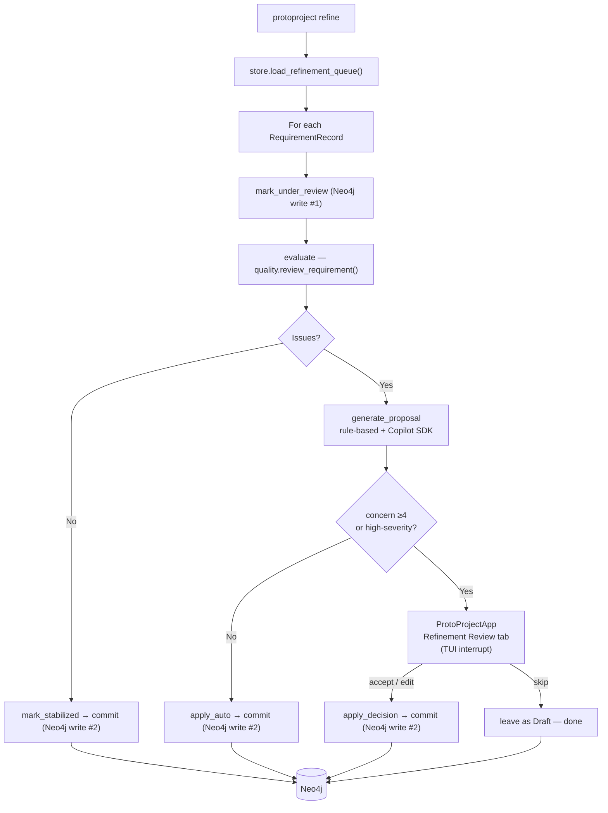

# Phase 2: The Conversational Architect — Implementation Plan

## Background

Phase 1 delivered a complete ingest pipeline: raw text → LLM/mechanical parser → Neo4j graph, with a Textual TUI for read-only review. Phase 2 promotes ProtoProject from a passive storage bin to an **active design partner**: a LangGraph workflow automatically refines all `Draft` requirements, pausing for human input only when concern or severity warrants it, with every decision committed to Neo4j immediately so any interrupted session can be resumed without rework.

---

## Decisions Recorded

| Question | Decision |
|---|---|
| LLM backend for AI refinement | **Copilot SDK** (same client as Phase 1 parser) |
| Batch vs. single-shot | **Batch over all Drafts** — auto where possible, interactive where needed |
| Resumability | **Persist each decision immediately** via `Under_Review` checkpoint state in Neo4j |
| TUI strategy | **One unified `ProtoProjectApp`** — extend, not replace, `IngestReviewApp`; ingest tab becomes interactive too |

---

## What Already Exists (from Phase 1)

| Asset | Status |
|---|---|
| `models.py` — `QualityIssue`, `RefinementProposal`, `ReviewResult` | ✅ complete |
| `quality.py` — `review_requirement()`, `propose_refinement()` | ✅ complete |
| `refinement.py` — `build_review()`, `apply_refinement()` | ✅ complete |
| `store.py` — `persist_requirement_revision()`, `[:SUPERSEDES]` | ✅ complete |
| `tui.py` — read-only `IngestReviewApp` | ⚠️ superseded by unified app |
| `cli.py` — `review` sub-command (single-shot) | ⚠️ needs `refine` workflow |
| LangGraph, Copilot SDK | ✅ already in `requirements.txt` |

---

## Resumability Design

The `state` field on `RequirementRecord` (already persisted in Neo4j) is the checkpoint:

```text
Draft  →  Under_Review  →  Stabilized
                       →  Superseded   (old version, replaced by new Draft/Stabilized)
```

**Session start / resume logic (`refine` command):**

1. Pull all `Under_Review` requirements first — these were mid-flight when a prior session was interrupted.
2. Then pull `Draft` requirements up to `--limit`.
3. **Immediately** `SET r.state = 'Under_Review'` when a requirement is dequeued, before any LLM call.
4. Each LangGraph workflow run commits the final state (`Stabilized` or the new `Draft` version) before moving on.
5. A hard-killed or crashed session leaves nodes in `Under_Review`; on the next run they are picked up again, the quality check re-run (cheap deterministic op), and processing continues from the commit step.

This means **no external checkpoint file** is needed — Neo4j is the source of truth.

---

## Proposed Changes

### Component 1 — LangGraph Workflow Engine

#### [NEW] [workflow.py](file:///workspaces/protoproject/src/protoproject/workflow.py)

Defines `RefinementWorkflow` wrapping a compiled LangGraph `StateGraph`.

**State schema (`RefinementState` — TypedDict):**

```python
{
    "requirement":   RequirementRecord,
    "issues":        list[QualityIssue],
    "proposal":      RefinementProposal | None,
    "human_decision": HumanDecision | None,   # set by TUI interrupt handler
    "committed":     bool,
}
```

**Graph nodes and wiring:**

```text
mark_under_review
    → evaluate
    → [no issues]  mark_stabilized → commit
    → [has issues] generate_proposal
                       → [low concern & no high-severity] apply_auto → commit
                       → [high concern or high-severity]  human_review* → apply_decision → commit
```

`*` LangGraph interrupt node — execution pauses; the caller (CLI) presents the TUI and then calls `workflow.resume(decision)`.

**`mark_under_review` node:**

- Calls `store.mark_requirement_state(req.id, "Under_Review")` immediately.
- This is the first write — ensures crash-safety.

**`evaluate` node:**

- Calls `quality.review_requirement()` — pure Python, no LLM, instant.

**`generate_proposal` node:**

- Calls `quality.propose_refinement()` for rule-based text fixes.
- Then makes a **Copilot SDK** call (same pattern as Phase 1 `parser.py`) to further improve the proposed text, passing: the original requirement, identified issue codes, and the rule-based draft proposal as context.
- Falls back gracefully to the rule-based proposal if the Copilot call fails or no token is available.
- Reports LLM usage via `emit_progress()` (consistent with Phase 1 observability).

**`apply_auto` node:**

- Calls `refinement.apply_refinement(req, proposal.proposed_text, proposal.concern_value)`.
- Generates a fresh embedding (reuses the `SentenceTransformerProvider`).
- Sets `state = "Stabilized"` on the new version (overriding the `"Draft"` that `apply_refinement` currently sets — see store note below).

**`apply_decision` node:**

- Same as `apply_auto` but uses `human_decision.text` and `human_decision.concern_value`.

**`commit` node:**

- Calls `store.persist_requirement_revision(revised_req)`.
- Sets `committed = True` in state.

**Public API:**

```python
class RefinementWorkflow:
    def run_one(self, requirement: RequirementRecord) -> WorkflowOutcome
    # WorkflowOutcome.status: "stabilized" | "auto_refined" | "needs_human" | "skipped" | "error"
    # WorkflowOutcome.pending_review: ReviewResult | None  (set when needs_human)

    def resume(self, requirement_id: str, decision: HumanDecision) -> WorkflowOutcome
    # Resumes from the human_review interrupt
```

---

### Component 2 — Models additions

#### [MODIFY] [models.py](file:///workspaces/protoproject/src/protoproject/models.py)

Add two small dataclasses:

```python
@dataclass(slots=True)
class HumanDecision:
    """The user's choice at a human-review interrupt."""
    action: str          # "accept" | "edit" | "skip"
    text: str            # accepted or edited requirement text
    concern_value: int

@dataclass(slots=True)
class WorkflowOutcome:
    """Result returned after processing one requirement."""
    requirement_id: str
    status: str          # "stabilized" | "auto_refined" | "needs_human" | "skipped" | "error"
    revised: RequirementRecord | None = None
    pending_review: ReviewResult | None = None
    error: str | None = None
```

Also update `apply_refinement()` in `refinement.py` to accept an optional `target_state` parameter (defaults to `"Draft"` for backward compatibility) so the workflow can pass `"Stabilized"` directly.

---

### Component 3 — Neo4j Store Additions

#### [MODIFY] [store.py](file:///workspaces/protoproject/src/protoproject/store.py)

Add three methods:

**`load_refinement_queue(limit: int) → list[RequirementRecord]`**

```cypher
MATCH (r:Requirement)
WHERE r.state IN ['Under_Review', 'Draft']
RETURN r ORDER BY
  CASE r.state WHEN 'Under_Review' THEN 0 ELSE 1 END,
  r.timestamp
LIMIT $limit
```

Maps Neo4j rows back to `RequirementRecord` (embedding stored as list in Neo4j, cast to `list[float]`).

**`mark_requirement_state(req_id: str, state: str) → None`**

```cypher
MATCH (r:Requirement {id: $id}) SET r.state = $state
```

Lightweight single-property update — called immediately on dequeue.

**`count_by_state() → dict[str, int]`**

```cypher
MATCH (r:Requirement) RETURN r.state AS state, count(*) AS n
```

Used by the CLI summary line and TUI status bar.

---

### Component 4 — Unified TUI

#### [MODIFY] [tui.py](file:///workspaces/protoproject/src/protoproject/tui.py)

Replace the read-only `IngestReviewApp` with a single **`ProtoProjectApp`** that handles both the ingest review and the refinement workflow review in one coherent interface.

**Structure:**

```text
ProtoProjectApp
├── Header (title changes per mode)
├── TabbedContent
│   ├── TabPane "Ingested Requirements"   ← was IngestReviewApp, now interactive
│   ├── TabPane "Audit Issues"            ← same as Phase 1
│   └── TabPane "Refinement Review"       ← NEW, only shown in refine mode
└── Footer (key bindings update per tab)
```

**Ingested Requirements tab (now interactive):**

- Same `DataTable` as Phase 1.
- New binding `r` on a selected row → triggers refinement of that single requirement inline (calls back to the CLI/workflow layer via a message).
- New binding `c` → opens a mini concern-value editor for the selected row.

**Refinement Review tab (Phase 2 new tab):**

Shown when the workflow pauses at a `needs_human` result. Displays:

- **Top panel**: requirement ID, layer, version, current state, current concern value.
- **Issues list**: `DataTable` — code, severity, message for each `QualityIssue`.
- **Proposal text**: an editable `TextArea` pre-filled with `proposal.proposed_text`. User can type freely to modify.
- **Concern value**: a `Label` + up/down keys to adjust 1–5 (displayed as `CV: [4]`).
- **Key bindings** (shown in Footer):
  - `a` → Accept the proposal text as displayed in the TextArea.
  - `s` → Skip — leave the requirement in `Draft` state and move on.
  - `q` → Quit the refine run entirely.

The app returns a `HumanDecision` from `run()` which the CLI passes to `workflow.resume()`.

**Backward compatibility:** Any code that currently instantiates `IngestReviewApp(result)` is updated to `ProtoProjectApp(ingest_result=result)`. The constructor accepts either an `IngestResult` (ingest mode) or a `ReviewResult` (refine mode), defaulting to ingest-only tab layout.

---

### Component 5 — CLI `refine` Sub-Command

#### [MODIFY] [cli.py](file:///workspaces/protoproject/src/protoproject/cli.py)

**New argument parser entry:**

```text
protoproject refine [--limit N] [--no-tui] [--req-id REQ_ID]
```

- `--limit N` (default 100): cap on how many requirements to process in one session.
- `--req-id REQ_ID`: target a single requirement by ID (useful for debugging or manual re-runs).
- `--no-tui`: plain-text prompts for high-concern decisions (non-TTY / CI mode).

**`_run_refine()` function:**

```text
1. Connect to Neo4jStore (same env-based config as ingest).
2. Call store.load_refinement_queue(limit).
3. Print opening summary: "X Draft, Y Under_Review queued."
4. For each requirement:
   a. call workflow.run_one(requirement)
   b. if outcome.status == "needs_human":
        if no-tui or not isatty: plain-text prompt loop
        else: ProtoProjectApp(review_result=outcome.pending_review).run() → decision
        call workflow.resume(req.id, decision)
   c. emit progress line for each outcome
5. Print closing summary: "X stabilized, Y auto-refined, Z skipped, W errors."
```

Progress lines (stderr, consistent with Phase 1 style):

```text
[refine:evaluate]  REQ-001 | 2 issues (high)     → needs_human
[refine:auto]      REQ-002 | 1 issue  (medium)   → stabilized  (v2)
[refine:human]     REQ-003 | accepted by user     → stabilized  (v2)
[refine:clean]     REQ-004 | no issues            → stabilized
```

---

### Component 6 — Progress / Observability

#### [MODIFY] [progress.py](file:///workspaces/protoproject/src/protoproject/progress.py)

Add `RefineProgressEvent` dataclass (parallel to `IngestProgressEvent`):

```python
@dataclass(slots=True)
class RefineProgressEvent:
    stage: str           # "mark_under_review" | "evaluate" | "generate_proposal"
                         # | "apply_auto" | "human_review" | "commit"
    status: str          # "started" | "completed" | "needs_human" | "skipped" | "error"
    requirement_id: str
    message: str
    action: str | None = None   # "stabilized" | "auto_refined" | "human_accepted" | "skipped"
    usage: LLMUsageSummary | None = None   # set when Copilot call is made
```

`CliProgressReporter.__call__` is extended to handle `RefineProgressEvent` in addition to `IngestProgressEvent` (single reporter, two event types).

---

### Component 7 — Tests

#### [MODIFY] [tests/test_session2.py](file:///workspaces/protoproject/tests/test_session2.py)

Existing three unit tests remain unchanged. Add:

- `test_apply_refinement_stabilized_state`: verify that passing `target_state="Stabilized"` produces a `Stabilized` record.
- `test_human_decision_dataclass`: trivial construction test for `HumanDecision`.

#### [NEW] [tests/test_workflow.py](file:///workspaces/protoproject/tests/test_workflow.py)

Uses a `MockStore` (no Neo4j required) and a `MockCopilotClient` (returns a canned response). Tests:

| Test | Scenario | Expected outcome |
|---|---|---|
| `test_auto_refines_low_concern` | `concern_value=2`, `NO_MODAL_VERB` | `status="auto_refined"`, `version=2`, no human_review |
| `test_stabilizes_clean_requirement` | No issues | `status="stabilized"`, same version, state=`Stabilized` |
| `test_escalates_high_severity` | `TOO_SHORT` (high) | `status="needs_human"`, commit not called yet |
| `test_resume_accept` | Resume with `action="accept"` | committed, `state="Stabilized"`, `version=2` |
| `test_resume_skip` | Resume with `action="skip"` | state remains `Draft`, no new version |
| `test_copilot_fallback` | Copilot raises exception | Falls back to rule proposal, still auto-refines |
| `test_under_review_resumption` | Requirement already `Under_Review` on start | `mark_under_review` is idempotent, evaluation proceeds |
| `test_store_load_refinement_queue_ordering` | Mix of Draft + Under_Review | Under_Review comes first |

#### [NEW] [tests/test_store_phase2.py](file:///workspaces/protoproject/tests/test_store_phase2.py)

Integration tests (skipped if `NEO4J_URI` not set):

- `test_load_refinement_queue_returns_records`
- `test_mark_requirement_state`
- `test_count_by_state`

---

## Data Flow Summary



---

## Verification Plan

### Automated Tests

```bash
source .venv/bin/activate
pytest tests/test_session2.py tests/test_workflow.py -v
# Integration (requires Neo4j):
pytest tests/test_store_phase2.py -v
# All Phase 1 tests must still pass:
pytest tests/test_phase1.py -v
```

### Manual Verification

1. `python src/test_env.py` — confirm Neo4j + Copilot SDK connectivity.
2. `protoproject ingest <file>` — populate Draft nodes.
3. `protoproject refine --no-tui --limit 5` — run batch in plain mode; confirm progress lines on stderr.
4. Open Neo4j Browser: confirm `[:SUPERSEDES]` relationships, `Stabilized` and `Superseded` states.
5. Kill the process mid-run; re-run; confirm `Under_Review` nodes are picked up first and not re-processed from scratch.
6. Run with TUI (`protoproject refine --limit 5`) in a live terminal; exercise accept, edit, and skip on a high-concern requirement.
